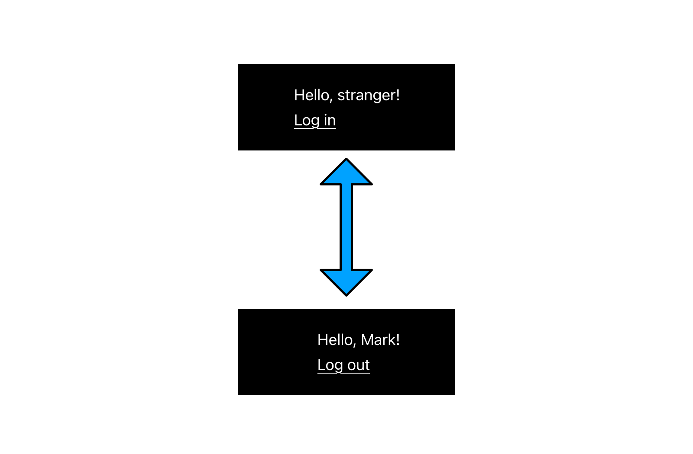
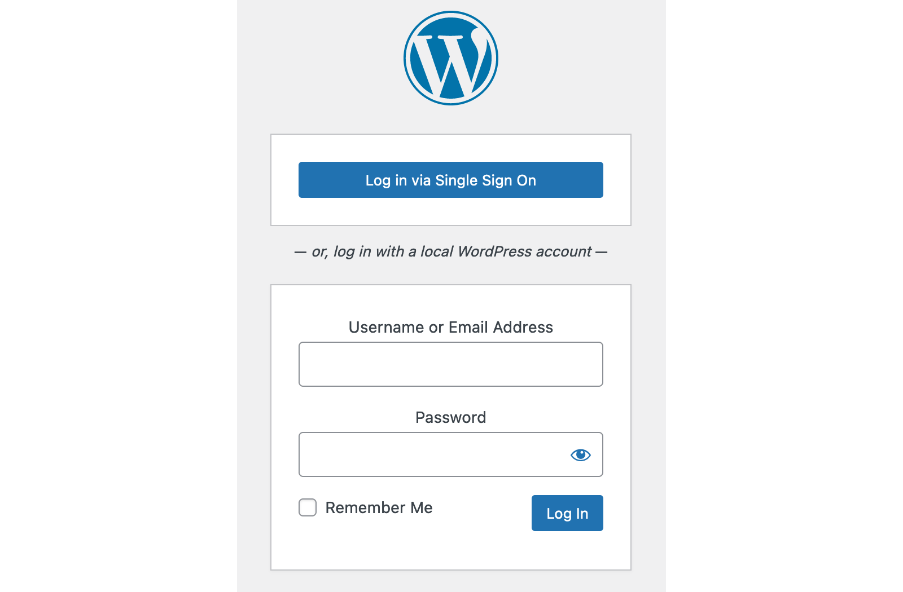
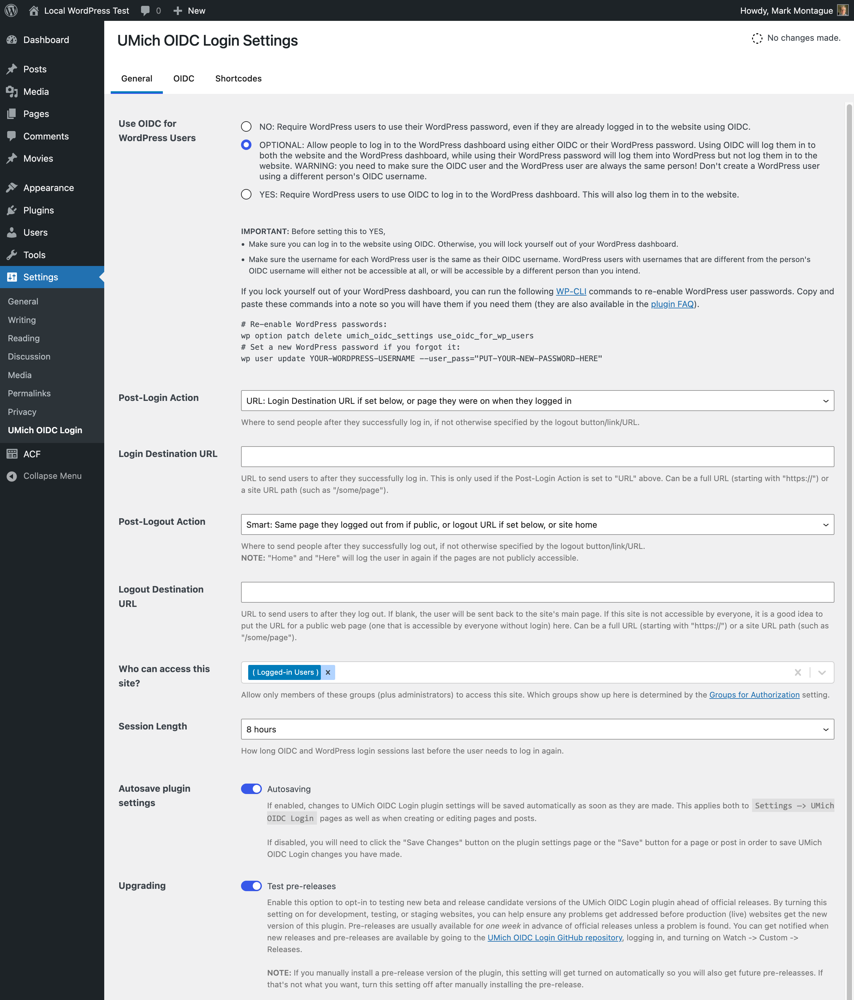
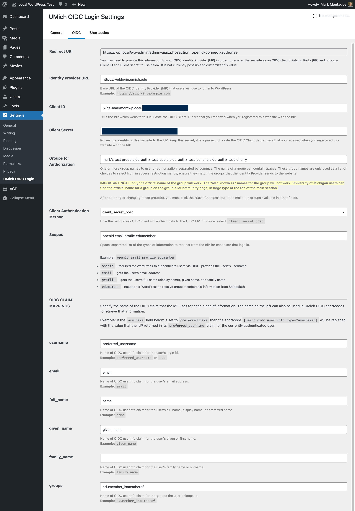
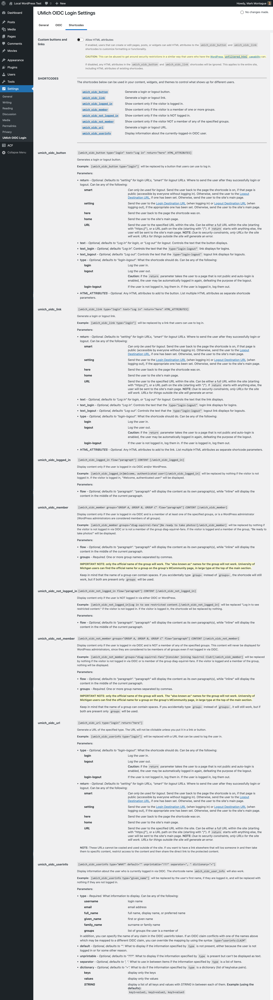
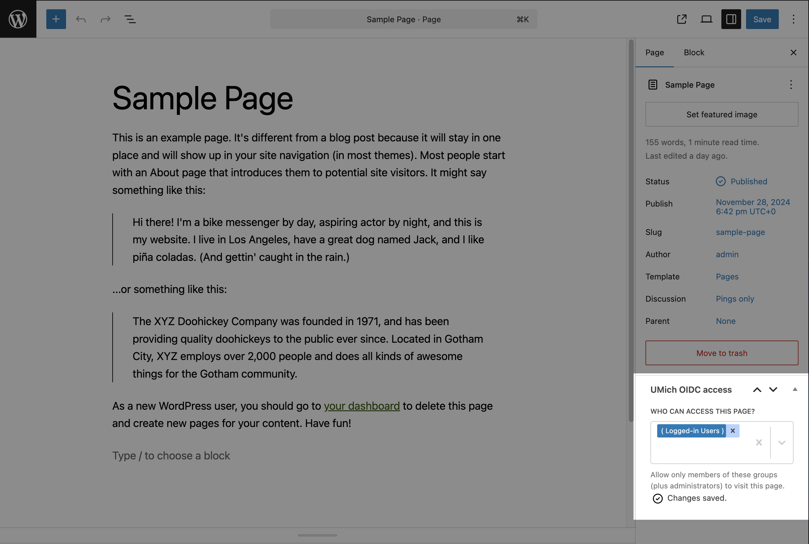

# UMich OIDC Login plugin for WordPress

UMich OIDC Login is a WordPress plugin that allows users to log in to a WordPress website and/or the site's WordPress administration dashboard using OpenID Connect (OIDC).  Users' group membership information sent via OIDC can be used to restrict who can access various parts of the website (including the whole website).

## Quick links

* [Get started / install instructions](#install)

    _(cloning the GitHub repository or downloading the source code **will not work**)_


* [Features](#features)


* [Frequently Asked Questions](#frequently-asked-questions)


* Report a bug, get help, or request a feature: [Open a GitHub issue](https://github.com/its-webhosting/umich-oidc-login/issues) or email [webmaster@umich.edu](mailto:webmaster@umich.edu)


* Build the plugin from source or contribute to the code: read [CONTRIBUTING.md](CONTRIBUTING.md)


## Features

* Allows site visitors to log in via OIDC without needing a WordPress user account.
* Allows or requires WordPress users to log in via OIDC instead of using their WordPress password.
* Can restrict access based on whether the user is logged in via OIDC, and whether they logged-in user is a member of one or more groups
  * Can restrict access to the entire site.
  * Can restrict access to specific pages and posts.
  * Can show content within a page/post/widget only to users meeting certain criteria.
* Access restrictions apply to site visitors, feeds, the REST API, and XMLRPC.
* Search results from WordPress' built-in search only shows content that the searching user has access to.
    * **WARNING:** Third-party WordPress search plugins may show content that the user does not have access to, leaking private information.  Please test search plugins for this before enabling them.
* Shortcodes (Gutenberg blocks planned for a future release)
	* `umich_oidc_button` - Generate a login or logout button.
	* `umich_oidc_link` - Generate a login or logout link.
	* `umich_oidc_logged_in` - Show content only if the visitor is logged in.
	* `umich_oidc_member` - Show content only if the visitor is a member of one or more groups.
	* `umich_oidc_not_logged_in` - Show content only if the visitor is NOT logged in.
	* `umich_oidc_not_member` - Show content only if the visitor NOT a member of the specified groups.
	* `umich_oidc_url` - Generate a login or logout URL.
	* `umich_oidc_userinfo` - Display information about the currently-logged-in OIDC user.
* Supported / tested OIDC providers:
    * [Shibboleth](https://www.shibboleth.net/) OIDC using the `edumember_ismemberof` attribute for LDAP group membership.


## Install

### Requirements
* WordPress 6.0 or later
* PHP 7.3 or later
* Client credentials for a supported OIDC provider (for example, Shibboleth OIDC)

### Install steps

1. (Recommended but not required) Install the [WordPress Native PHP Sessions](https://wordpress.org/plugins/wp-native-php-sessions/) plugin from the WordPress.org plugin repository or by uploading the files to your web server. For details, see [How to Install a WordPress Plugin](https://www.wpbeginner.com/beginners-guide/step-by-step-guide-to-install-a-wordpress-plugin-for-beginners/). **UMich OIDC Login strongly recommends using the WordPress Native PHP Sessions plugin to prevent conflicts with other WordPress plugins that also use PHP sessions, and to ensure correct operation when the site resides on multiple web servers.**
1. Install the UMich OIDC Login plugin from GitHub.  This plugin is not available through wordpress.org.  Use _one_ of the following methods of installing the plugin:
	1. **WP Admin Dashboard Method:**  This requires that your site has write access to the plugins folder:
		1. Download the umich-oidc-login.zip file for the latest package from https://github.com/its-webhosting/umich-oidc-login/releases/latest
		   Important: do not download the source code (the source code has to be built before it can be used on a site)
		2. Go to the WordPress admin dashboard -> Plugins -> Add New -> Upload Plugin
		3. Select the zip file you downloaded file and click Upload
		4. Activate the plugin
	1. **Manual Method:**
		1. Download the umich-oidc-login.zip file for the latest package from https://github.com/its-webhosting/umich-oidc-login/releases/latest
		   Important: do not download the source code (the source code has to be built before it can be used on a site)
		2. Extract the contents of the zip file
		3. Upload the umich-oidc-login folder to the wp-content/plugins/ folder in your site.  The final location should be wp-content/plugins/umch-oidc-login
		4. Activate the plugin using the WordPress admin dashboard
	1. **WP CLI Method:** (if you have the `wp`, `jq`, and `curl` commands installed):
   ```bash
	   plugin_url=$(curl -s "https://api.github.com/repos/its-webhosting/umich-oidc-login/releases/latest" | jq -r '.assets[0].browser_download_url')
	   wp plugin install "${plugin_url}" --activate```
1. Activate both the WordPress Native PHP Sessions and the UMich OIDC Login plugins through the 'Plugins' menu in WordPress.
1. Under the Settings menu in WordPress, navigate to "UMich OIDC Login" and then click on the "OIDC" tab.  Make a note of the Redirect URI value for use when registering an OIDC client for your WordPress site.
1. Register an OIDC client for your WordPress site.  On the OIDC tab of the UMich OIDC Login settings page, fill in the information you got when registering your client.  At a minimum, this will be the Identity Provider URL, Client ID, and Client Secret.  Click the "Save Changes button".
1. You can now use the settings on the General tab to control access to the website, as well as login and logout behavior.  You can restrict access to individual posts and pages by editing them and changing their document settings.  You can also use shortcodes from the Shortcodes tab in your theme and/or website content.  Adding the following shortcodes to your theme will display a greeting and a login/logout button.

```
Hello, [umich_oidc_userinfo type="given_name" default="stranger"]
[umich_oidc_button]
```

For more details, refer to [the documentation from the University of Michigan](https://teamdynamix.umich.edu/TDClient/30/Portal/KB/ArticleDet?ID=9181).


## Screenshots

### Log in and log out without a WordPress user account



Visitors can log in via OIDC without needing a WordPress user account.  UMich OIDC Login gets information about logged-in visitors from the OIDC Identity Provider.

### WordPress user account log in page



The plugin can be configured to let WordPress users log in to WordPress using either OIDC or their WordPress username and password.

The plugin can also be configured to use _only_ OIDC for logging in to WordPress.

### General settings



Control what happens when visitors/users log in and log out.

### OIDC settings



Use group information obtained through OIDC to control access to the website.

### Shortcodes



Use shortcodes to control who sees which things within pages, posts, and themes.

### Access control metabox



Use group information obtained through OIDC to control access to individual posts and pages.


## Frequently Asked Questions

### Why do I have to enter all groups the site uses on the settings page?

For privacy reasons, UMich OIDC Login is currently designed to work with OIDC Identity Providers that restrict which groups can be used for to share membership information with websites.  Only the official names of groups can be used; aliases will not work.
Entering the official group names allows content authors to select the groups from a dropdown list, making things easier and preveting many errors.

### Help! OIDC stopped working and now I can't log in to my WordPress dashboard!

Use [WP CLI](https://wp-cli.org) to turn off OIDC for WordPress users:

`wp option patch delete umich_oidc_settings use_oidc_for_wp_users`

You should then be able to log in to WordPress using your WordPress username and password for your website.

Or, completely turn off the UMich OIDC Login plugin.  WARNING: deactivating the plugin will make any restricted content you have publicly viewable.

`wp plugin deactivate umich-oidc-login`

If you don't remember your WordPress user account password, you can set a new one:

`wp user update YOUR-WORDPRESS-USERNAME --user_pass="PUT-YOUR-NEW-PASSWORD-HERE"`

### How can I report an issue, get help, request a feature, or help with plugin development?

[Open a GitHub issue](https://github.com/its-webhosting/umich-oidc-login/issues) or email [webmaster@umich.edu](mailto:webmaster@umich.edu)


## Copyright and license information

Copyright (c) 2022 Regents of the University of Michigan.

This file is part of the UMich OIDC Login WordPress plugin source code.

UMich OIDC Login is free software: you can redistribute it and/or modify it under the terms of the GNU General Public License as published by the Free Software Foundation, either version 3 of the License, or (at your option) any later version.

UMich OIDC Login is distributed in the hope that it will be useful, but WITHOUT ANY WARRANTY; without even the implied warranty of MERCHANTABILITY or FITNESS FOR A PARTICULAR PURPOSE. See the GNU General Public License for more details.

You should have received a copy of the GNU General Public License along with UMich OIDC Login. If not, see <https://www.gnu.org/licenses/>.
